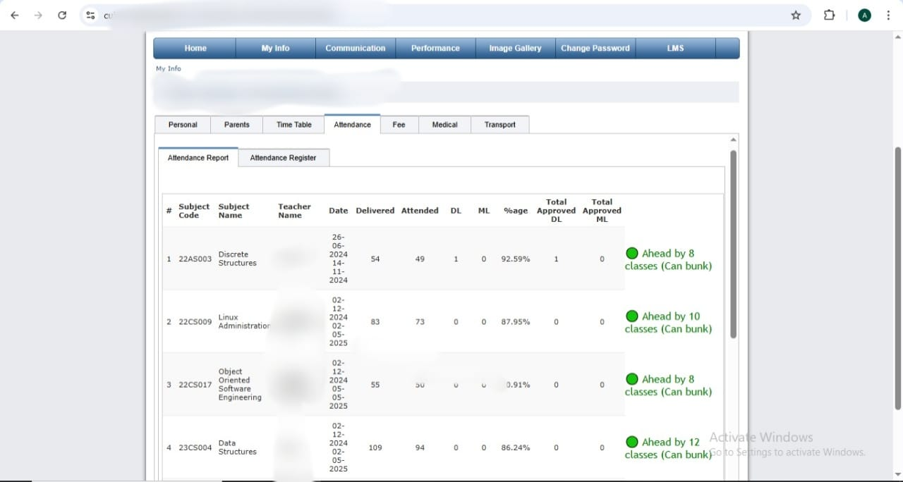

# ✅ Chalkpad Pro Attendance Tracker Extension for Chitkara Students

**Chalkpad Pro Attendance Tracker** is a lightweight and powerful Chrome extension built specifically for **Chitkara University students**.  
It helps you instantly check how many classes you can safely **bunk** (or how many you need to attend) — right inside your Chalkpad Pro attendance page.

---

## 🎯 Built for 75% Attendance Rule

This extension works with the **75% attendance criteria** followed at Chitkara.  
It tells you for **each subject**:

- ✅ How many more classes you can **safely miss** while staying above 75%
- ⚠️ How many **extra classes you need to attend** if you're below 75%

---

## 💡 What It Does

When you open the **attendance section** in Chalkpad Pro:

- A new column appears for each subject
- It shows either:
  - `✔️ Bunkable: X classes` — if you're above 75%
  - `❗Attend: X more classes needed` — if you're below 75%
- All calculations are based on total and attended classes

> 📌 **Note:** This extension calculates class-wise. If you have **2 classes in a day**, it will count **2 separately**. So plan your bunks accordingly.

> ⚠️ **Disclaimer:** While this extension is made to help you, **always cross-check your final attendance manually** for full safety. Don’t rely blindly.

---

## 🖥️ How to Install (Step-by-Step)

> 🕒 Takes less than 1 minute

### 1. **Download ZIP**
- Click the green **`Code`** button on this GitHub page
- Select **`Download ZIP`**
- Extract it to a folder on your computer

### 2. **Open Chrome Extensions Page**
- Go to: `chrome://extensions/`
- Enable **Developer Mode** (top-right)

### 3. **Load the Extension**
- Click **Load unpacked**
- Select the folder you just extracted

🎉 That’s it! Now open your Chalkpad Pro attendance page and see the new bunk info.

---

## 📸 Preview

---

## 🔐 100% Private & Secure

- No login or account needed
- No data is collected or shared
- Works only in your browser, for your convenience

---

## 🙋 Need Help?

Have any issues or feedback?

- Open an [issue on GitHub](https://github.com/abhayshah31/Chalkpad-Pro-Attendance-Tracker/issues)
- Or reach out to the developer directly

---

## 🤝 Want to Contribute?

Pull requests and ideas are welcome!

---

Made with ❤️ by a Chitkara student, for Chitkara students.
