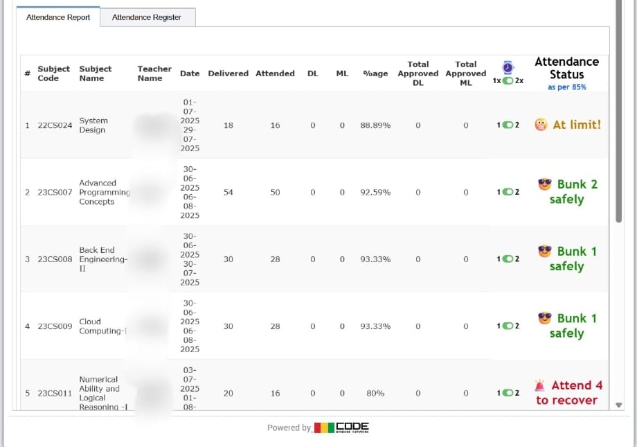

# ✅ Chalkpad Pro Attendance Tracker — Chrome Extension for Chitkara University Students

**Chalkpad Pro Attendance Tracker** is a powerful and privacy-friendly **Chrome extension** designed to help **Chitkara University** students track and manage their **attendance** directly from the **Chalkpad Pro portal**.

> 🔍 Ideal for students following the 75% attendance rule at Chitkara. ** NOTE: Currently changed for 85% attendane rule..**

---

## 🚀 Features — What This Chrome Extension Does

When you're on the Chalkpad Pro attendance page, this extension automatically adds a helpful new column next to each subject:

- ✅ **Shows how many classes you can bunk** while maintaining 85% 
- ❗ **Displays how many more classes you need to attend** if you're below 85%
- 📊 Real-time calculation based on your attended vs total classes
- ⚡ Fast, lightweight, and built specifically for Chalkpad Pro (Chitkara)

---

## 🎯 Built for Chitkara's 85% Attendance Policy

This tool is tailored for the **85% minimum attendance** rule followed by Chitkara University. It helps you plan smartly:

- ✔️ *Bunkable: X classes* — if your attendance is safe
- ❗ *Attend: X more classes needed* — if your attendance is low

> 🧠 Smart logic: Each class is counted individually — so 2 lectures = 2 counts. **2 lectures means 50 min each lect.**
---

## 🛠️ Installation Guide (Takes Less Than 1 Minute)

Follow these simple steps to install the extension:

### 1. Download the Extension
- Click the green **`Code`** button on this GitHub page
- Select **`Download ZIP`**
- Extract the folder on your device

### 2. Enable Developer Mode in Chrome
- Open: `chrome://extensions/`
- Toggle **Developer Mode** (top-right)

### 3. Load the Extension
- Click **Load unpacked**
- Select the extracted folder

✅ Done! Open your Chalkpad Pro attendance page to see it in action.

---

## 📸 Screenshot / Preview

---

## 🔐 Privacy & Security

- No login required
- No data collected or stored
- Works entirely in your local browser
- Open-source and transparent

---

## 📢 Why Use This?

- 📚 For Chitkara students who want to track and plan attendance smartly
- 🕵️‍♂️ Avoid surprises before exams
- 📉 Minimize risk of short attendance
- 🔒 100% secure — works only in your browser

---

## 💬 Need Help?

Have a problem, suggestion, or bug?

- 📂 [Open an issue](https://github.com/abhay-prashar/Chalkpad-Pro-Attendance-Tracker/issues)
- ✉️ Or reach out to the developer directly

---

## 🤝 Contribute

Pull requests, bug reports, and feature ideas are welcome!

> Help improve this tool for the Chitkara student community ❤️

---

## 📢 Keywords for Search Engines

Chalkpad Pro Extension, Chitkara University Chrome Extension, Attendance Tracker Chitkara, Chalkpad Attendance Tool, Chalkpad Bunk Calculator, Chalkpad Attendance 75 Percent Rule, Chalkpad Chrome Plugin

---

Made with ❤️ by a Chitkara student, for Chitkara students.
